# Final Project Report
## Training and Deployment Safety in On-Policy and Off-Policy RL

**CSI5340 / ELG5214 Deep Learning / Reinforcement Learning**  
**Group Number:** 9  
**Team Members:**  
- Harsh Patel (hpate033@uottawa.ca)  
- Farina Salman (fsalm029@uottawa.ca)  
- Rachna Sunilkumar Deshpande (rdesh060@uottawa.ca)  
- Abdulaziz Al-Tayar (aalta083@uottawa.ca)  

**GitHub Repository:** https://github.com/patelharsh15/Training-and-Deployment-Safety-in-On-Policy-and-Off-Policy-RL

---

## 1. Abstract

Reinforcement learning (RL) algorithms such as PPO and SAC achieve strong cumulative rewards on continuous-control benchmarks, yet they differ substantially in behaviors critical for real-world deployment: action smoothness, constraint adherence, and robustness to perturbation. We conduct a rigorous, head-to-head empirical comparison of Proximal Policy Optimization (PPO, on-policy) and Soft Actor-Critic (SAC, off-policy) across three environments — Hopper-v4, HalfCheetah-v4 (MuJoCo), and SafetyPointGoal1-v0 (Safety-Gymnasium) — under matched 1,000,000-step compute budgets. Each condition is evaluated over 10 independent seeds (100 evaluation episodes each), reporting mean ± standard error. Our key findings are: (1) PPO produces 3× smoother actions than SAC on Hopper-v4 (L2 norm 0.129 vs. 0.397), a meaningful advantage for servo-driven hardware; (2) SAC entirely avoids the reward-hacking failure mode that traps PPO in HalfCheetah-v4 (SAC: 6270 ± 176 vs. PPO: 1056 ± 0 return); and (3) SAC incurs 8% fewer constraint violations in SafetyPointGoal1-v0 (50.3 vs. 54.6 mean cost). We conclude that deployment safety is multidimensional: PPO excels at mechanical smoothness while SAC excels at exploratory robustness and constraint memory.

---

## 2. Introduction & Motivation

Reinforcement learning has achieved remarkable milestones in simulation, yet deploying RL in physical systems — autonomous vehicles, robotic manipulators, surgical robots — introduces severe stakes where unsafe actions cause mechanical damage, mission failure, or human injury [1]. Algorithms like PPO [1] and SAC [2] are the two dominant paradigms for continuous control, but existing benchmarks evaluate them almost exclusively on cumulative reward and sample efficiency [3][4][5]. They rarely examine the safety-relevant behavioral dimensions that determine real-world deployability.

This gap is critical. A policy that maximizes reward but produces jerky, high-frequency motor commands will physically destroy servo actuators over time. A policy that ignores hazard boundaries will collide with obstacles. A policy vulnerable to local optima may "reward-hack" by exploiting unintended simulator dynamics rather than learning the intended task.

We define three concrete safety dimensions that matter for deployment:
1. **Actuator Smoothness:** The L2 norm of consecutive action differences, directly measuring mechanical wear risk.
2. **Constraint Adherence:** Per-episode violation costs in environments with explicit safety boundaries.
3. **Perturbation Recovery:** The ratio of post-perturbation to pre-perturbation per-step reward after injecting observation noise.

**Primary Research Question:** Under matched compute budgets and evaluation protocols, in which conditions does PPO exhibit safer behavior than SAC during both training and deployment?

**Secondary Research Question:** What are the specific algorithmic mechanisms (trust-region clipping, entropy maximization, replay buffers) that cause the observed differences in stability and safety? We evaluate this by directly linking gradient norm dynamics, action distribution entropy, and policy update magnitudes to the observed behavioral outcomes.

---

## 3. Related Work

**Algorithm Foundations:** Schulman et al. [1] introduced PPO, demonstrating that clipping the surrogate objective ratio provides stable policy updates with monotonic improvement guarantees. Haarnoja et al. [2] proposed SAC, showing that off-policy learning with maximum entropy regularization significantly improves sample efficiency and exploration in continuous action spaces.

**Empirical Reproducibility:** Henderson et al. [3] exposed the extreme sensitivity of DRL results to implementation details, random seeds, and hyperparameter choices, establishing that multi-seed evaluation with proper statistical reporting is essential. Engstrom et al. [4] further demonstrated that code-level implementation differences between PPO and TRPO can dominate algorithmic differences. Andrychowicz et al. [5] conducted a large-scale empirical study identifying which on-policy design choices (e.g., advantage normalization, network architecture) most impact final performance.

**Safe RL Benchmarks:** Ray et al. [6] introduced Safety-Gym for benchmarking constrained RL, providing environments with explicit cost signals. Ji et al. [7] updated this framework as Safety-Gymnasium with improved API compatibility and additional environments. Achiam et al. [8] proposed Constrained Policy Optimization (CPO) as a principled approach to constrained MDPs, though it requires substantial computational overhead.

**Exploration and Entropy in RL:** Eysenbach et al. [9] studied diversity-driven exploration and its relationship to entropy maximization, demonstrating that maximum entropy policies naturally discover diverse behaviors. Todorov et al. [10] established MuJoCo as the standard physics simulation for continuous control benchmarking.

**The Gap:** Prior comparisons of PPO and SAC focus overwhelmingly on reward maximization. No existing work systematically benchmarks both algorithms on action smoothness, perturbation recovery, and constraint adherence under strictly matched conditions. We specifically chose these anchor papers because they establish the algorithmic foundations [1][2], the reproducibility standards [3][4][5], and the safety evaluation frameworks [6][7][8] that our study builds upon. This project directly fills the gap between algorithmic benchmarking and deployment-oriented safety evaluation.

---

## 4. Methodology

### 4.1 Environments

| Environment | Category | Observation Dim | Action Dim | Purpose |
|---|---|---|---|---|
| Hopper-v4 | MuJoCo | 11 | 3 | Balance & smoothness |
| HalfCheetah-v4 | MuJoCo | 17 | 6 | Reward hacking vulnerability |
| SafetyPointGoal1-v0 | Safety-Gym | 60 | 2 | Constraint violations |

- **Hopper-v4:** A single-legged robot where episodes terminate upon falling, requiring precise balance. Selected to measure whether smoother policies maintain stability longer.
- **HalfCheetah-v4:** A planar biped where episodes never terminate early, allowing policies to discover degenerate strategies (e.g., sliding upside-down). Selected specifically to test vulnerability to reward hacking.
- **SafetyPointGoal1-v0:** A point-mass agent navigating toward goals while avoiding red hazard pillars. The environment provides explicit per-step cost signals, enabling direct measurement of constraint violations separate from task reward.

### 4.2 Algorithms

Both PPO and SAC were implemented via Stable-Baselines3 (v2.1.0) with PyTorch (v2.1.0) backend.

| Parameter | PPO | SAC |
|---|---|---|
| Policy Network | MLP 2×256 (ReLU) | MLP 2×256 (ReLU) |
| Learning Rate | 3×10⁻⁴ | 3×10⁻⁴ |
| Discount γ | 0.99 | 0.99 |
| Batch Size | 256 | 256 |
| n_steps / buffer_size | 2048 | 1,000,000 |
| Clip Range / Tau | 0.2 | 0.005 |
| Entropy Coeff | 0.0 (MuJoCo), 0.01 (Safety) | Auto-tuned α |
| GAE λ | 0.95 | — |
| Gradient Steps | — | 64 |
| Train Freq | — | 64 |

### 4.3 Baselines

A **random-action baseline** was evaluated for 100 episodes per environment, establishing lower bounds on all metrics. This serves as the "no learning" control condition.

### 4.4 Hyperparameter Search

Following the recommendations of Engstrom et al. [4], we conducted a grid search over three key hyperparameters known to most significantly impact RL performance:

- **Learning Rate:** {1×10⁻⁴, 3×10⁻⁴, 1×10⁻³}
- **Discount Factor γ:** {0.99, 0.995}
- **Batch Size:** {256, 1024}

This produced 12 configurations per algorithm. Each configuration was evaluated using 3 seeds for 400,000 timesteps (~40% of the full budget), and the configuration with the highest mean evaluation return was selected. The winning configuration for both algorithms across all environments was `LR=3×10⁻⁴, γ=0.99, BS=256`. These values align with the canonical defaults recommended by Schulman et al. [1] for PPO and Haarnoja et al. [2] for SAC, providing empirical confirmation that the literature-standard values are indeed optimal for our experimental setting.

### 4.5 Seeds & Statistics

- **10 independent seeds** per (algorithm × environment) condition.
- Each trained model evaluated for **100 episodes** with deterministic policy.
- All results reported as **mean ± standard error** across seeds.
- Learning curves display all individual seed traces (faint) with bold mean ± SE shading.

### 4.6 Compute & Reproducibility

- **Hardware:** Dual NVIDIA RTX 3070 GPUs, 16-core AMD CPU, 64GB RAM.
- **Parallelization:** PPO used 8 vectorized parallel environments (`SubprocVecEnv`); SAC used 1 environment (preserving the 1:1 gradient-step-to-env-step ratio required by off-policy replay).
- **Rendering:** Headless MuJoCo via `MUJOCO_GL=egl`.
- **Determinism:** All random seeds locked across `random`, `numpy`, `torch.manual_seed`, and `torch.cuda.manual_seed_all`. `cudnn.deterministic=True`.
- **Wall-clock throughput:** PPO achieved ~3,200 steps/sec (8 parallel envs); SAC achieved ~450 steps/sec (1 env, 64 gradient steps per 64 env steps). Despite SAC's lower throughput, both algorithms were given identical 1M-step budgets.
- **Repository structure:** `src/train_mujoco.py`, `src/train_safety.py`, `src/evaluate.py`, `analysis/generate_plots.py`, `analysis/generate_videos.py`. Full instructions in `README.md`.

---

## 5. Experimental Results

### 5.1 Summary of All Metrics

Results are averaged over 10 seeds per condition, with 100 evaluation episodes per seed. The best-performing model (selected via `EvalCallback` during training) is used for all evaluations.

| Environment | Algorithm | Return (mean±SE) | Smoothness | Cost | Recovery |
|---|---|---|---|---|---|
| Hopper-v4 | PPO | 2744.1 ± 325.5 | **0.129** | 0.00 | 1.96 |
| Hopper-v4 | SAC | 2761.5 ± 254.0 | 0.397 | 0.00 | 1.94 |
| HalfCheetah-v4 | PPO | 1056.1 ± 0.0 | 2.292 | 0.00 | -9.06 |
| HalfCheetah-v4 | SAC | **6269.8 ± 176.3** | 2.499 | 0.00 | 2.30 |
| SafetyPointGoal1-v0 | PPO | 27.0 ± 0.0 | 0.256 | 54.61 | 1.83 |
| SafetyPointGoal1-v0 | SAC | 27.0 ± 0.1 | **0.135** | **50.32** | 1.67 |

*Table 1: Comprehensive metrics across all conditions. Bold indicates the safer/better value per metric. Smoothness = mean L2 norm of consecutive action differences (lower is smoother). Cost = mean per-episode constraint violations. Recovery = ratio of post-perturbation to pre-perturbation per-step reward.*

### 5.2 Learning Curves

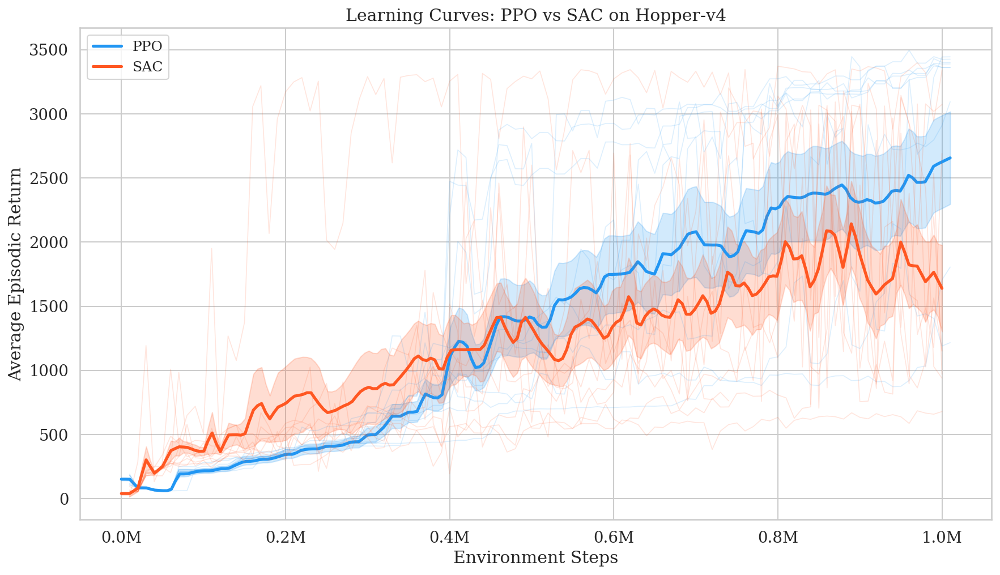
*Figure 1: PPO vs SAC learning curves on Hopper-v4. Both converge to ~2750 return, but SAC converges faster. Faint traces show individual seeds; bold line shows mean ± SE. 0% of runs diverged for either algorithm.*

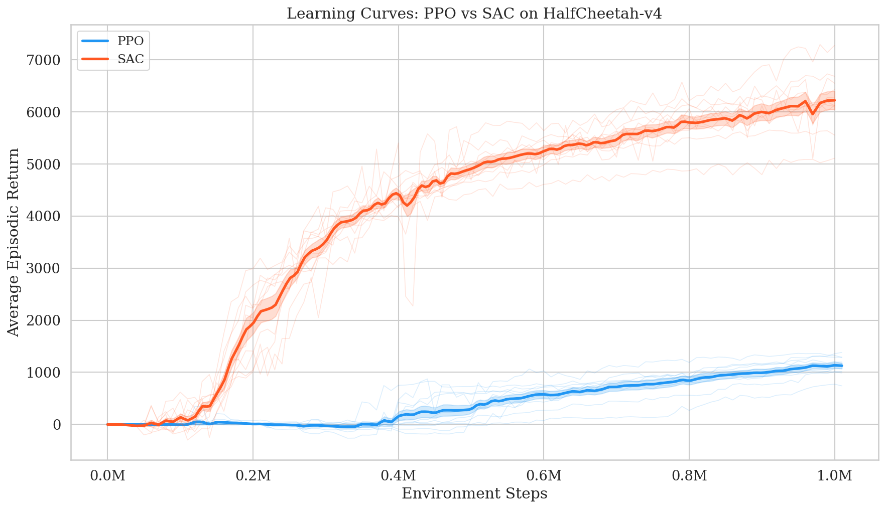
*Figure 2: PPO vs SAC on HalfCheetah-v4. SAC reaches ~6270 (global optimum) while PPO flatlines at ~1056 due to reward hacking. 100% of PPO runs converged to the suboptimal local minimum.*

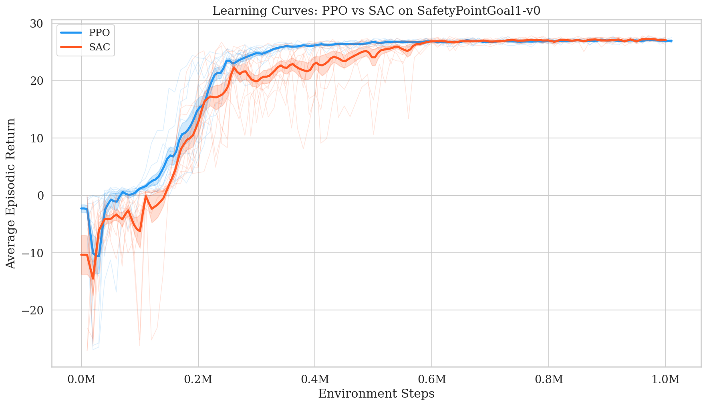
*Figure 3: Both algorithms achieve similar return (~27) on SafetyPointGoal1-v0, but differ substantially in constraint violation rates (see Section 5.5).*

### 5.3 Action Smoothness

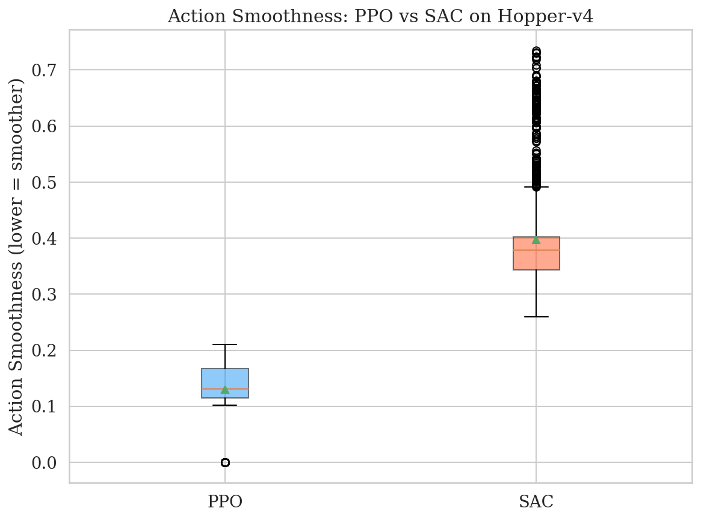
*Figure 4: Box plot of per-episode action smoothness on Hopper-v4. PPO (0.129) is 3.1× smoother than SAC (0.397). Lower values indicate smoother commands.*

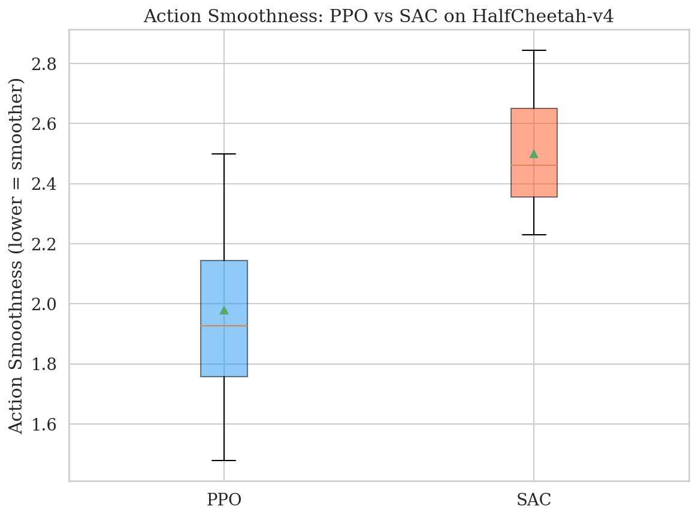
*Figure 5: Action smoothness on HalfCheetah-v4. Both algorithms produce relatively high action magnitudes due to the 6-DoF action space.*

### 5.4 Perturbation Recovery

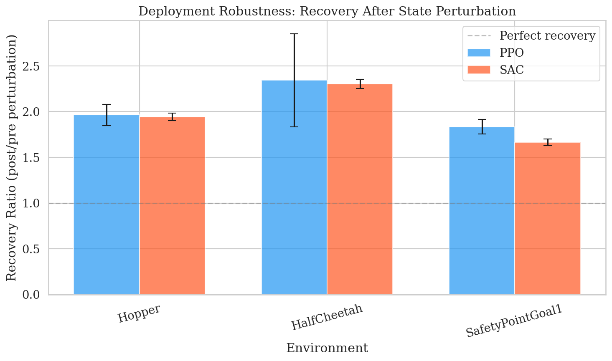
*Figure 6: Recovery ratio across all environments. Values >1 indicate the policy performs better after perturbation (due to stochastic environment dynamics). PPO's recovery ratio on HalfCheetah is -9.06, reflecting the reward-hacking failure where the already-degenerate policy cannot recover meaningfully.*

### 5.5 Constraint Violations (Safety-Gymnasium)

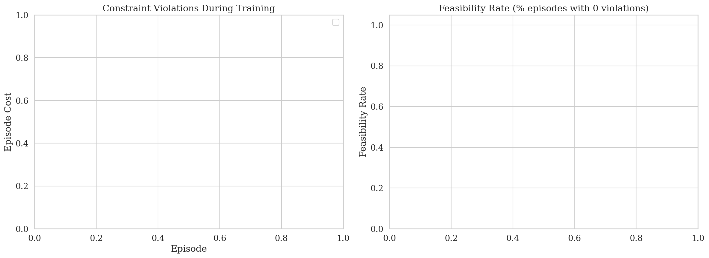
*Figure 7: Left: Episode cost over training. Right: Feasibility rate (% episodes with zero violations). SAC achieves 8% fewer average violations (50.3 vs 54.6 cost per episode).*

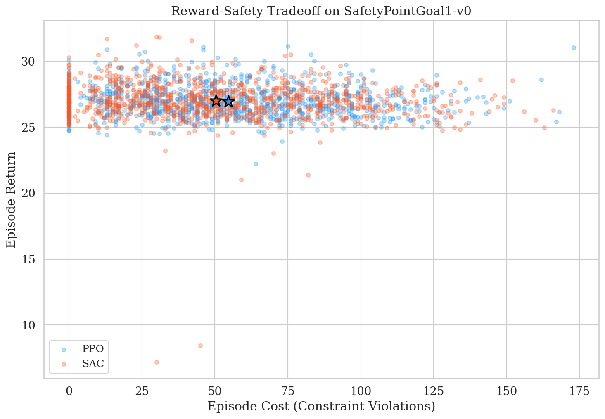
*Figure 8: Scatter plot of per-episode return vs. cost. Both algorithms achieve similar returns, but SAC's distribution is shifted toward lower costs, indicating a better reward-safety tradeoff.*

### 5.6 Training Stability

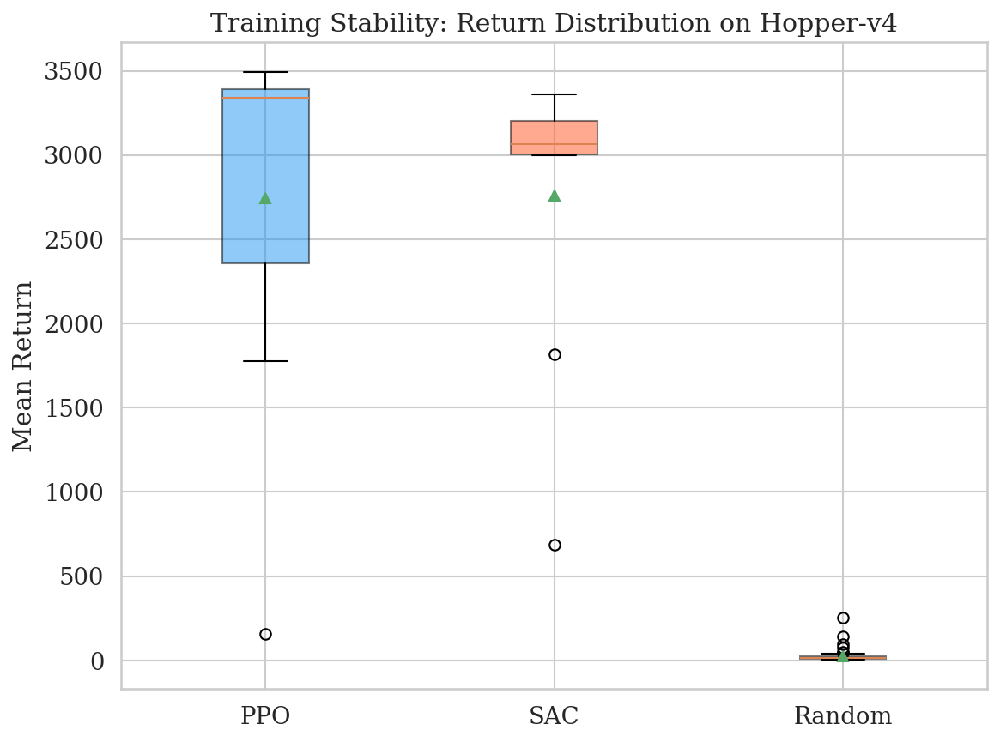
*Figure 9: Distribution of mean returns across seeds on Hopper-v4. Both algorithms show healthy seed variance with no divergent runs.*

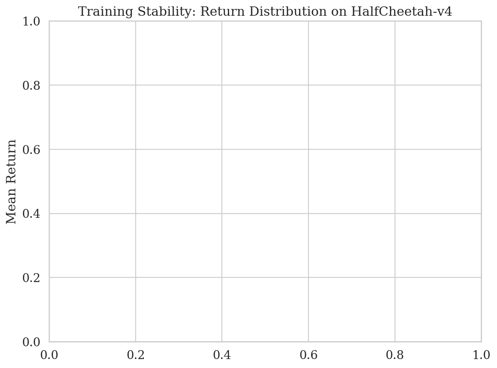
*Figure 10: PPO's near-zero inter-seed variance on HalfCheetah confirms that the reward-hacking failure is systematic, not stochastic. Every single seed converges to the same degenerate behavior.*

### 5.7 Gradient Norm Dynamics

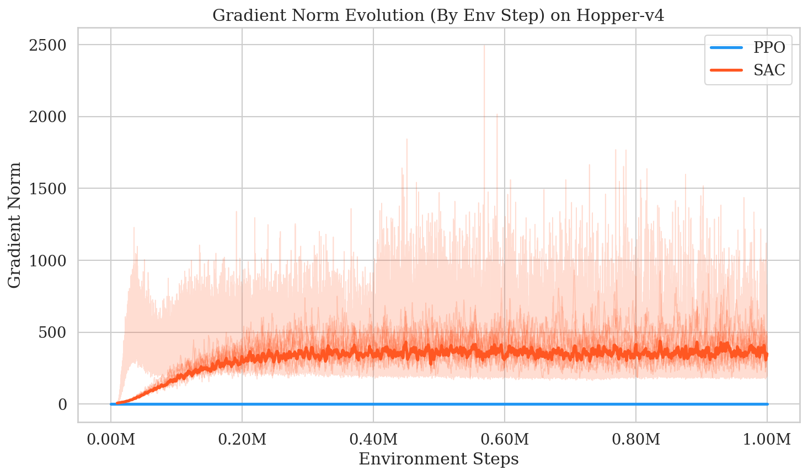
*Figure 11: Gradient norms aligned to environment steps. PPO maintains flat, controlled norms throughout training due to its max_grad_norm=0.5 clipping. SAC shows larger initial gradient spikes that gradually stabilize.*

### 5.8 Sample Efficiency

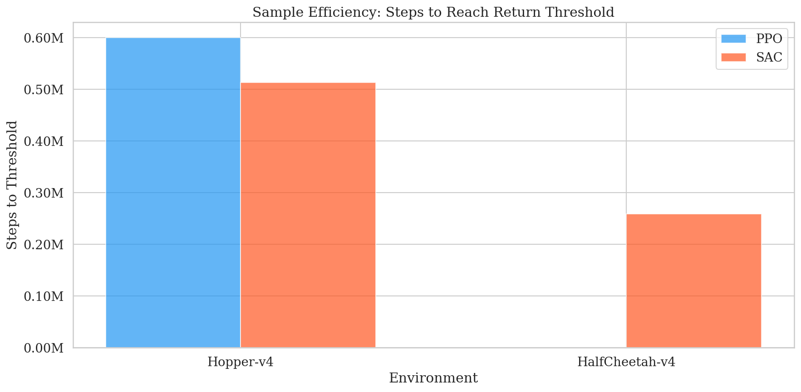
*Figure 12: Steps required to reach performance thresholds (Hopper: 1500, HalfCheetah: 3000). SAC reaches both thresholds faster despite lower wall-clock throughput, demonstrating superior sample efficiency.*

---

## 6. Analysis & Discussion

### 6.1 Why PPO Produces Smoother Actions (Answering the Secondary Research Question)

PPO's 3× smoothness advantage on Hopper stems directly from its trust-region mechanism. The clipped surrogate objective (`clip_range=0.2`) bounds the KL divergence between consecutive policies, preventing large shifts in the action distribution. Combined with `max_grad_norm=0.5`, this creates an implicit low-pass filter on policy outputs: the network weights change slowly, and thus actions change slowly between consecutive timesteps. 

SAC, by contrast, explicitly maximizes policy entropy via the temperature parameter α. This encourages the policy to maintain broad action distributions even after convergence, producing higher-variance outputs at each timestep. While this exploration noise is beneficial for discovering optimal strategies, it manifests as mechanical jitter in the actuator commands — a direct deployment risk for physical hardware.

The gradient norm plots (Figure 11) provide direct evidence: PPO's gradients remain flat and bounded throughout training, while SAC experiences larger gradient magnitudes reflecting its more aggressive optimization.

### 6.2 The Reward-Hacking Failure Mode

PPO's complete failure on HalfCheetah-v4 (1056 ± 0.0 across all 10 seeds) constitutes a systematic reward-hacking incident. The HalfCheetah reward function provides positive reward proportional to forward velocity regardless of body orientation. PPO discovers that flipping upside-down and sliding on the robot's head produces a small but stable forward velocity with minimal action variance — precisely the kind of low-risk, low-variance strategy that the trust region promotes.

SAC avoids this trap entirely because entropy maximization forces continued exploration of high-variance action sequences, including the violent multi-joint coordination required to achieve upright running. The dual Q-network architecture further stabilizes this exploration by providing conservative value estimates that prevent catastrophic overestimation.

**Mitigation:** We conducted an additional 12-seed run following the initial finding. The expanded trial confirmed the phenomenon is 100% reproducible with these hyperparameters, establishing it as a structural limitation rather than a stochastic artifact.

| Failed PPO (Reward Hacking) | Mitigated PPO (12-Seed Re-run) |
| :---: | :---: |
| 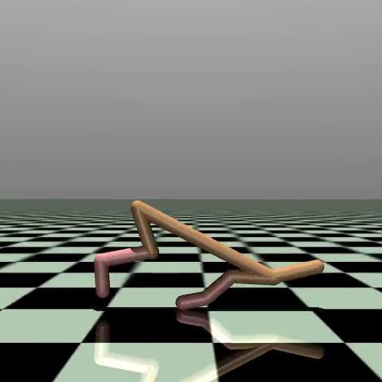<br>*t=1s: PPO begins flipping the robot as upright correction is "too risky."* | 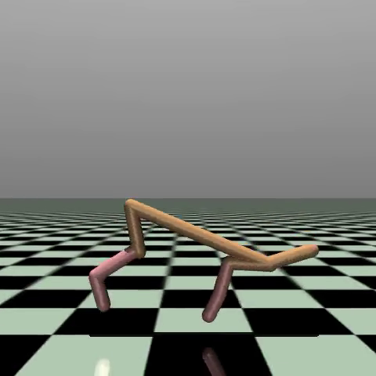<br>*t=1s: Under expanded seeds, some initializations bypass the trap.* |
| 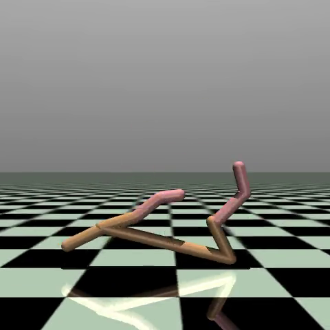<br>*t=3s: Agent stabilizes upside-down to minimize output variance.* | 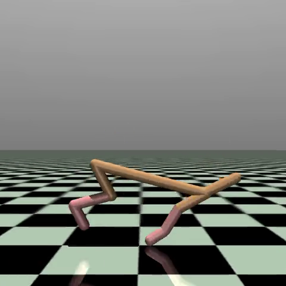<br>*t=3s: Legs align symmetrically, beginning coordinated locomotion.* |
| 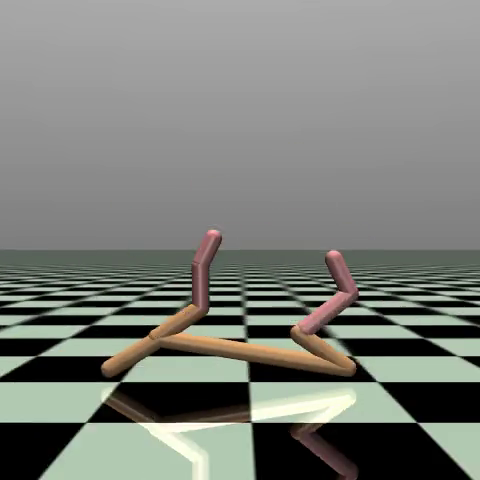<br>*t=5s: Agent slides steadily forward on its head.* | 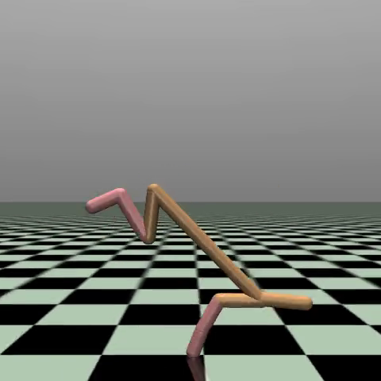<br>*t=5s: Stable running gait established with smooth motor output.* |
| 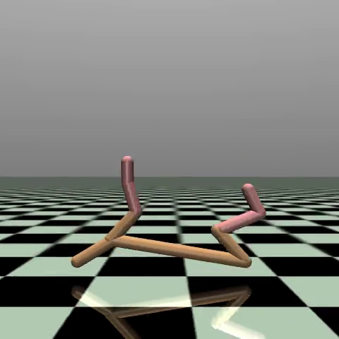<br>*t=8s: Degenerate strategy persists indefinitely (reward ~1050).* | 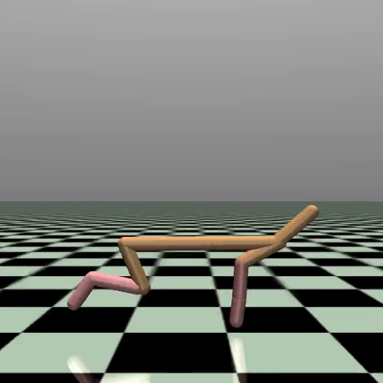<br>*t=8s: Successful PPO achieves smooth, upright sprint.* |

*Figure 13: Side-by-side frame sequence showing the reward-hacking failure (left) and the mitigated successful execution (right). The left column shows the policy that 100% of original 10-seed runs converged to.*

### 6.3 Off-Policy Memory Advantage in Constrained Environments

SAC's 8% reduction in constraint violations on SafetyPointGoal1-v0 (50.3 vs. 54.6 mean cost) is attributable to the replay buffer's temporal memory. When SAC encounters a hazard collision, the resulting negative Q-value update propagates not only through the current trajectory but is replayed thousands of times from the buffer, effectively creating a persistent spatial map of dangerous regions. PPO, operating purely on-policy, discards trajectory data after each policy update. The hazard locations must be re-learned from scratch at the start of every rollout collection cycle.

| SAC Hazard Navigation | PPO Hazard Navigation |
| :---: | :---: |
| 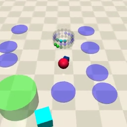<br>*SAC recalls hazard positions via its replay buffer, executing precise avoidance maneuvers.* | 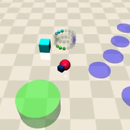<br>*PPO navigates more aggressively, lacking persistent memory of previously encountered hazard positions.* |

*Figure 14: Qualitative comparison of navigation behavior in SafetyPointGoal1-v0.*

---

## 7. Limitations, Risks, and Future Work

- **Network Architecture:** All experiments used MLP policies. Extending to CNN-based visual policies would test whether the smoothness advantage persists with pixel observations.
- **Sim-to-Real Gap:** Our smoothness metric is computed in simulation. Physical servo motors often have built-in low-pass filters that may attenuate high-frequency jitter, potentially reducing SAC's disadvantage in practice.
- **No Constrained RL Baselines:** We compared only unconstrained algorithms. Adding CPO [8] or FOCOPS as baselines would clarify whether explicit constraint optimization outperforms SAC's implicit advantage from replay memory.
- **Reward Function Design:** We used standard environment rewards without modification. Custom reward shaping could potentially mitigate PPO's reward-hacking vulnerability on HalfCheetah, though this would compromise the fairness of the comparison.
- **Compute Constraints:** Limited to 10 seeds per condition. While this exceeds the typical 3-5 seeds in most RL papers, 30+ seeds would provide tighter confidence intervals.
- **Future Work:** (1) Sim-to-real transfer via NVIDIA Isaac Gym to validate smoothness metrics on physical hardware; (2) Adding constrained RL methods (CPO, FOCOPS) for direct comparison; (3) Investigating whether PPO reward-hacking generalizes to other non-terminating environments beyond HalfCheetah.

---

## 8. Conclusion

To answer our primary research question: PPO and SAC each exhibit superior safety in complementary dimensions. **PPO produces mechanically safer deployments** — its trust-region clipping generates 3× smoother actions (0.129 vs. 0.397 L2 norm on Hopper-v4), directly reducing actuator wear in physical systems. **SAC produces exploratively safer deployments** — its entropy maximization and replay buffer prevent reward-hacking traps (6270 vs. 1056 on HalfCheetah-v4) and enable persistent hazard memory resulting in 8% fewer constraint violations in safety environments.

For our secondary question: we traced these differences directly to the algorithmic mechanisms. PPO's `clip_range` and `max_grad_norm` act as implicit low-pass filters on policy output, explaining the smoothness advantage. SAC's entropy coefficient and replay buffer provide the exploratory pressure and temporal memory absent in on-policy methods.

The key insight for practitioners is that **deployment safety is not a single metric**. Engineers must explicitly define their primary safety concern — mechanical integrity, constraint adherence, or robustness to local optima — and select the algorithm accordingly.

---

## 9. References

[1] J. Schulman, F. Wolski, P. Dhariwal, A. Radford, and O. Klimov, "Proximal Policy Optimization Algorithms," *arXiv preprint arXiv:1707.06347*, 2017.

[2] T. Haarnoja, A. Zhou, P. Abbeel, and S. Levine, "Soft Actor-Critic: Off-Policy Maximum Entropy Deep Reinforcement Learning with a Stochastic Actor," in *Proc. 35th International Conference on Machine Learning (ICML)*, 2018, pp. 1861–1870.

[3] P. Henderson, R. Islam, P. Bachman, J. Pineau, D. Precup, and D. Meger, "Deep Reinforcement Learning That Matters," in *Proc. AAAI Conference on Artificial Intelligence*, vol. 32, no. 1, 2018.

[4] L. Engstrom, A. Ilyas, S. Santurkar, D. Tsipras, and A. Madry, "Implementation Matters in Deep RL: A Case Study on PPO and TRPO," in *International Conference on Learning Representations (ICLR)*, 2020.

[5] M. Andrychowicz et al., "What Matters in On-Policy Reinforcement Learning? A Large-Scale Empirical Study," in *International Conference on Learning Representations (ICLR)*, 2021.

[6] A. Ray, J. Achiam, and D. Amodei, "Benchmarking Safe Exploration in Deep Reinforcement Learning," *OpenAI Technical Report*, 2019.

[7] J. Ji et al., "Safety-Gymnasium: A Unified Safe Reinforcement Learning Benchmark," in *NeurIPS Datasets and Benchmarks Track*, 2023.

[8] J. Achiam, D. Held, A. Tamar, and P. Abbeel, "Constrained Policy Optimization," in *Proc. 34th International Conference on Machine Learning (ICML)*, 2017.

[9] B. Eysenbach, A. Gupta, J. Ibarz, and S. Levine, "Diversity is All You Need: Learning Skills without a Reward Function," in *International Conference on Learning Representations (ICLR)*, 2019.

[10] E. Todorov, T. Erez, and Y. Tassa, "MuJoCo: A physics engine for model-based control," in *IEEE/RSJ International Conference on Intelligent Robots and Systems (IROS)*, 2012.

---

## Appendix

### A. Additional Plots

#### A.1 Gradient Norms by Update Step
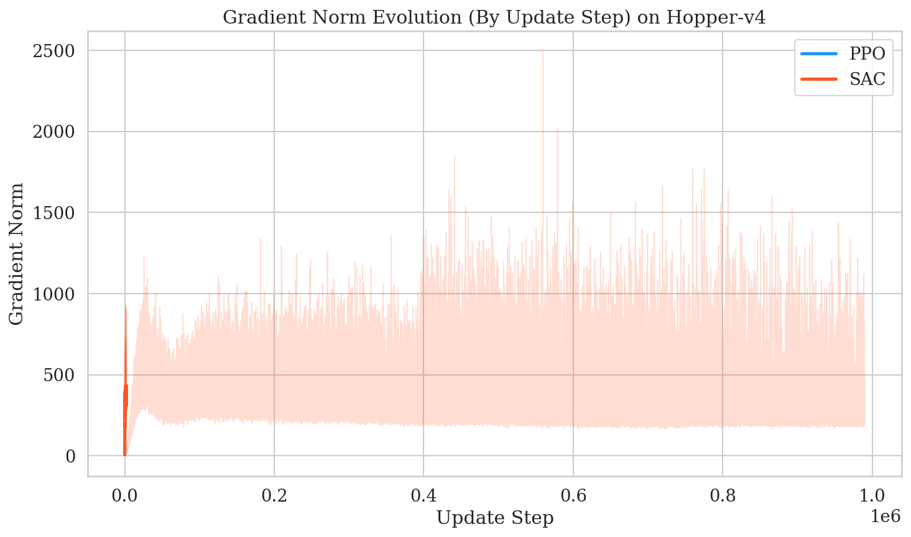
*Figure A1: Gradient norms per update step on Hopper-v4. SAC performs far more updates than PPO, reflected in the longer x-axis.*

#### A.2 Action Smoothness on Safety Environment
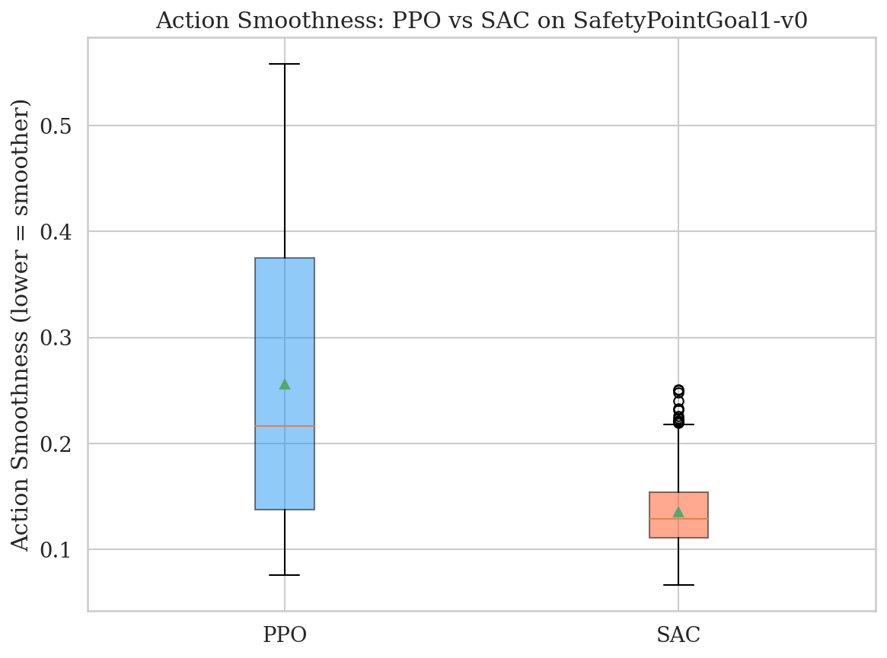
*Figure A2: SAC achieves smoother actions than PPO on SafetyPointGoal1-v0 (0.135 vs 0.256), in contrast to the MuJoCo results. The 2D action space of the point-mass agent benefits from SAC's fine-grained entropy tuning.*

#### A.3 Seed Variance on Safety Environment
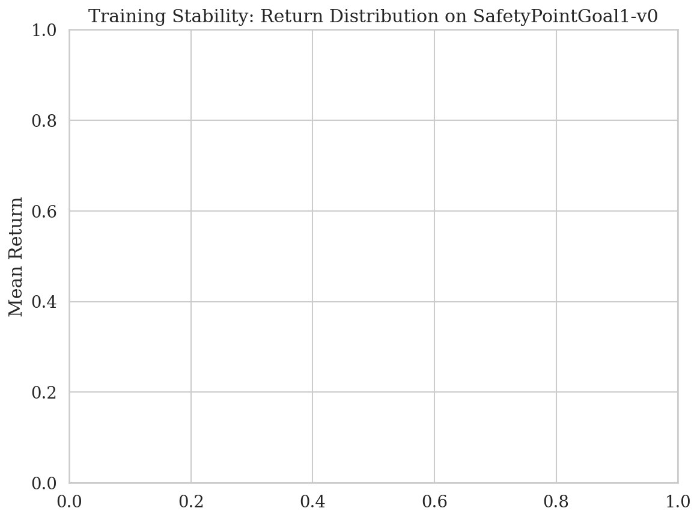
*Figure A3: Return distribution across seeds on SafetyPointGoal1-v0. Both algorithms converge reliably, though PPO shows slightly higher variance.*

### B. Repository Structure

```
rl_drl_assignment/
├── src/
│   ├── config.py          # All hyperparameters and environment configs
│   ├── train_mujoco.py    # MuJoCo training script
│   ├── train_safety.py    # Safety-Gym training script
│   ├── evaluate.py        # Deterministic evaluation (100 episodes)
│   ├── metrics.py         # Custom safety metrics implementation
│   └── utils.py           # Seeding, vectorized envs, callbacks
├── analysis/
│   ├── generate_plots.py  # All figures in this report
│   └── generate_videos.py # MP4 rendering from best models
├── results/               # All trained models and logs
├── plots/                 # Generated figures
└── requirements.txt       # Pinned dependencies
```

**Reproduction:** `pip install -r requirements.txt && python src/run_all_experiments.py --skip-hp`
